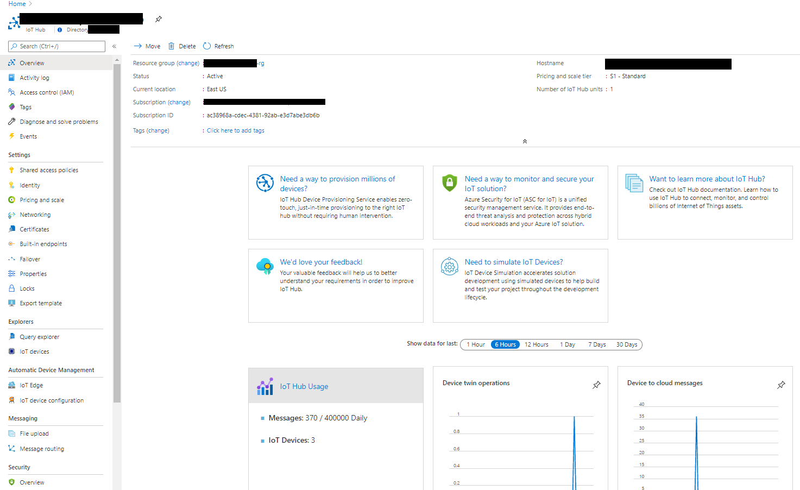
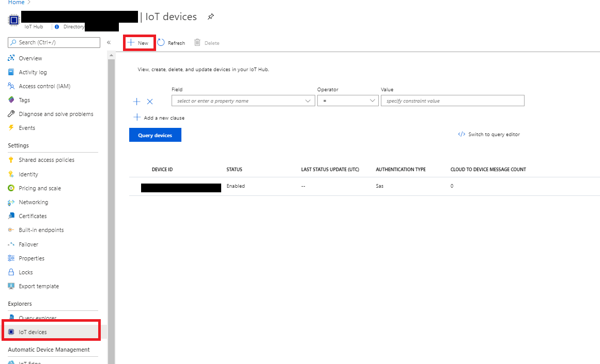
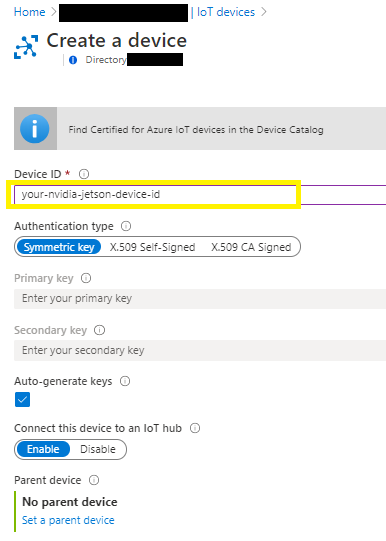
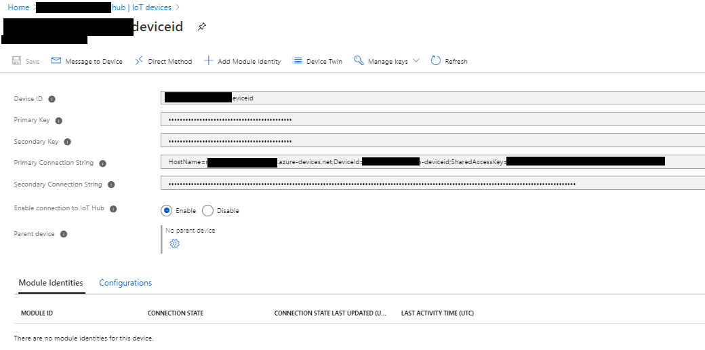
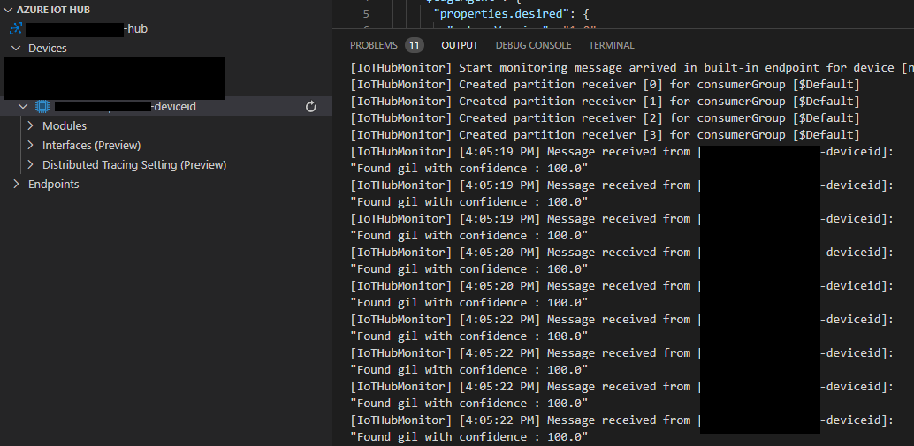

# How to use NVIDIA Jetson device to detect a custom object and post to Azure IoT Hub.

In this tutorial we will see how we can create a custom python code to detect an object in custom pre-trained model and post to Azure IoT Hub.  This tutorial leverages [@dusty-nv's](https://github.com/dusty-nv) custom trained model example mentioned [here](https://github.com/dusty-nv/jetson-inference/blob/master/docs/pytorch-collect.md) to create a custom pre-trained model.

# Prerequisites
## Azure IoT Hub setup
The very first step is to create Azure IoT Hub in your Azure subscription. Follow the directions mentioned below to setup Azure IoT hub.

[Create an IoT hub using the Azure portal](https://docs.microsoft.com/en-us/azure/iot-hub/iot-hub-create-through-portal)

Once the IoT Hub is setup, you can proceed with the steps mentioned in the following section to register your NVidia Jetson Nano device.
## Device conection setup
1. Navigate to your Azure IoT Hub.


2. Select "IoT devices" and select "+ New".


3. Enter the Device ID.



4. Save new device.
5. Select newly created device.
6. Save "Primary connection string". This will be used in defining "IOTHUB_DEVICE_CONNECTION_STRING" environment variable on NVIDIA Jetson device.


## Device pre-requisites
1. Custom pre-training model deployed on the device. 
1. Location path to the custom model file (.onnx file). This information is presented as --model parameter to the command mentioned in Steps section.
1. Location path to the classification text file (labels.txt). This information is presented as --labels parameter to the command mentioned in Steps section.
1. Class name of the object that is target object that needs to be detected. This is presented as --classNameForTargetObject.
1. Azure IoT Hub libraries for Python. Install the azure-iot-device package for IoTHubDeviceClient.
```bash
pip install azure-iot-device
```
# Steps
1. Clone the source code from repository or download the folder for Azure-Post. For example 'IoT' folder.
```bash
~/IoT
```
1. Open the Jetson-nano terminal window.
1. Navigate to the 'azureposts' folder as shown below:
```bash
~/IoT/nvidia-jetson-nano/samples/azure-post
```
1. Create  IOTHUB_DEVICE_CONNECTION_STRING variable that was saved as part of Azure IoT Hub Setup prerequisite as shown below:
```bash
export IOT_HUB_DEVICE_CONNECTION_STRING = "HOSTName=XXXXXX.azure-devices.net;DeviceId=XXXXX;SahredAccessKey=XXXXXXXXXX"
```
1. Run the following command
```bash
python custom-model-azure-post.py --classNameForTargetObject=[Target object class name] --model=[path to your custom model] --input_blob=input_0 --output_blob=output_0 --labels=[path to your datasets labels text file] --detectionThreshold=95
```

#### Parameter details:
    --classNameForTargetObject = class name for the object that you want to detect in your custom model
    --model = path to your custom model. 
    --labels = path for the labels file on your custom model
    --detectionThreshold = percentage value of threshold for object detection.


# Conclusion
In this tutorial we have seen how to use a custom pre-trained model to detect a particular object (based on detection threshold) and send message to Azure IoT.

Here is how the messages are received by Azure IoT Hub using visual studio code:
