# Create and Deploy Azure IoT Edge Module on NVIDIA Jetson device and send direct messages to the module

## Introduction

In this tutorial we will see how we can deploy an IoT Edge Module on NVidia Jetson Nano device and send direct message to the newly created module and get its response. This tutorial can also be used on any Linux VM that Azure IoT Edge runtime supports. Just deploy the Azure IoT Edge runtime and use that VM as your device.  

## Prerequisites

1. **Azure IoT Hub**. Steps to create Azure IoT Hub can be found [here](https://docs.microsoft.com/en-us/azure/iot-hub/iot-hub-create-through-portal)
2. **IoT Edge Device registered**. Details can be found [here](https://docs.microsoft.com/en-us/azure/iot-edge/how-to-register-device#register-in-the-azure-portal)
3. **Docker Image repository**: This will be used to push the container images to. This tutorial requires access to already created Docker Image Repository with user name and password. Details on how to create Azure Container Registry can be found [here](https://docs.microsoft.com/en-us/azure/container-registry/container-registry-get-started-portal)
4. **VS Code**
5. **Azure IoT Tools for VS Code**: This should configured and connected to your IoT Hub. More details can be found [here](https://marketplace.visualstudio.com/items?itemName=vsciot-vscode.azure-iot-tools)
6. **Preconfigured Nvidia Jetson device** with IoT Edge runtime installed and configured to use Azure IoT Edge. More details can be found [here](https://docs.microsoft.com/en-us/azure/iot-edge/how-to-install-iot-edge-linux). Or **Linux Virtual Machine** with Azure IoT Edge runtime installed and configured. More details can be found [here](https://docs.microsoft.com/en-us/azure/iot-edge/how-to-install-iot-edge-ubuntuvm). In this case "Linux Virtual Machine" will act as a device.

## Steps

### Setting up the environment

Step 1. Create device identity as shown below:

```bash
az iot hub device-identity create --device-id [your-azure-iot-edge-device] --edge-enabled --hub-name [your-azure-iot-hub_name]
```

Step 2. On VS Code open command palette and enter command Azure IoT Edge: New IoT Edge solution.

Step 3. Choose the location for solution files.

Step 4. Choose name for solution. NvidiaJetsonEdgeSolution was selected for this tutorial.

Step 5. On "Select module template" question, choose "Python Module".

Step 6. Enter the name for "Python Module". For this tutorial "RequestProcessorModule" was chosen.

Step 7. For "Provide Docker image repository" question, choose a pre-existing image repository followed by name of your repository. Example: [your-docker-image-registry].azurecr.io/requestprocessormodule
After the above step, VS Code will open a new window with the following view:

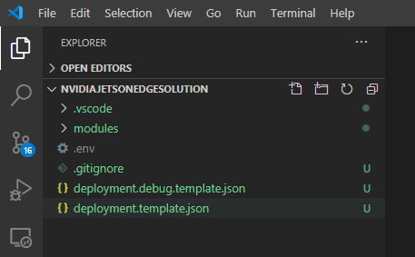

Step 8. Open the .env file and enter the user name and password for your docker image registry as shown below:
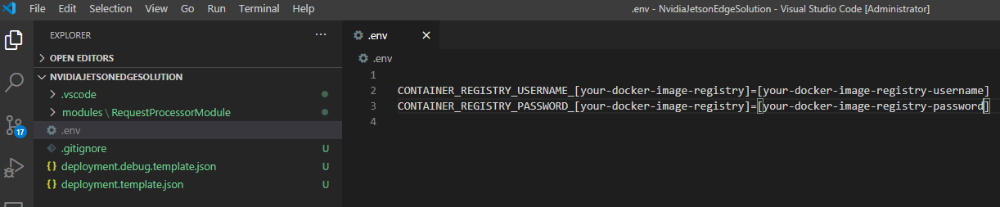

Step 9. On VS Code open the command palette and enter command "Azure IoT Edge: Set Default Target Platform for Edge Solution".

Step 10. Select "arm64v8" or your correct architecture. You can find out the architecture of your device by running the following command on the device:

```bash
$ uname -m
aarch64
```

In this case "aarch64" corresponds to "arm64v8".
Once the architecture is set the settings.json file would look like:
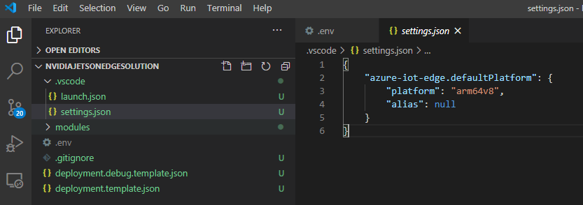

### Adding code

Step 1. Open "main.py"

Step 2 . Replace the code with the code mentioned below:

```python
# Copyright (c) Microsoft. All rights reserved.
# Licensed under the MIT license. See LICENSE file in the project root for
# full license information.

import json
import time
import os
import sys
import asyncio
from six.moves import input
import threading
from azure.iot.device.aio import IoTHubModuleClient
from azure.iot.device import MethodResponse

# global counters
TEMPERATURE_THRESHOLD = 25
TWIN_CALLBACKS = 0
RECEIVED_MESSAGES = 0

async def main():
    try:
        if not sys.version >= "3.5.3":
            raise Exception( "The sample requires python 3.5.3+. Current version of Python: %s" % sys.version )
        print ( "IoT Edge Module for Python - version:0.0.71120" )

        # The client object is used to interact with your Azure IoT hub.
        module_client = IoTHubModuleClient.create_from_edge_environment()

        # connect the client.
        await module_client.connect()

        # define behavior for receiving an input message on input1
        async def input1_listener(module_client):
            global RECEIVED_MESSAGES
            global TEMPERATURE_THRESHOLD
            while True:
                try:
                    method_request = await module_client.receive_method_request()
                    print (
                        "\nMethod callback called with:\nrequestID={request_id}\nmethodName = {method_name}\npayload = {payload}".format(
                            request_id=method_request.request_id,
                            method_name=method_request.name,
                            payload=method_request.payload
                        )
                    )
                    response_payload = {"Response": "Executed direct method {}".format(method_request.name)}
                    response_status = 200                    

                    # Creating a method response.
                    methodResponse = MethodResponse.create_from_method_request(method_request, response_status, response_payload)

                    # Responding back to the direct method call.                 
                    await module_client.send_method_response(methodResponse)

                    
                except Exception as ex:
                    print ("Unexpected error in input1_listener: %s" % ex)
                                     

        # twin_patch_listener is invoked when the module twin's desired properties are updated.
        async def twin_patch_listener(module_client):
            global TWIN_CALLBACKS
            global TEMPERATURE_THRESHOLD
            while True:
                try:
                    data = await module_client.receive_twin_desired_properties_patch()  # blocking call
                    print( "The data in the desired properties patch was: %s" % data)
                    if "TemperatureThreshold" in data:
                        TEMPERATURE_THRESHOLD = data["TemperatureThreshold"]
                    TWIN_CALLBACKS += 1
                    print ( "Total calls confirmed: %d\n" % TWIN_CALLBACKS )
                except Exception as ex:
                    print ( "Unexpected error in twin_patch_listener: %s" % ex )

        # define behavior for halting the application
        def stdin_listener():
            while True:
                try:
                    selection = input("Press Q to quit\n")
                    if selection == "Q" or selection == "q":
                        print("Quitting...")
                        break
                except:
                    time.sleep(10)

        # Schedule task for C2D Listener
        listeners = asyncio.gather(input1_listener(module_client), twin_patch_listener(module_client))

        print ( "The sample is now waiting for messages. ")

        # Run the stdin listener in the event loop
        loop = asyncio.get_event_loop()
        user_finished = loop.run_in_executor(None, stdin_listener)

        # Wait for user to indicate they are done listening for messages
        await user_finished

        # Cancel listening
        listeners.cancel()

        # Finally, disconnect
        await module_client.disconnect()

    except Exception as e:
        print ( "Unexpected error %s " % e )
        raise

if __name__ == "__main__":
    loop = asyncio.get_event_loop()
    loop.run_until_complete(main())
    loop.close()

    # If using Python 3.7 or above, you can use following code instead:
    # asyncio.run(main())
```


### Deploy

Step 1. Right click "deployment.template.json and select "Build and Push IoT Edge Solution" as shown below:
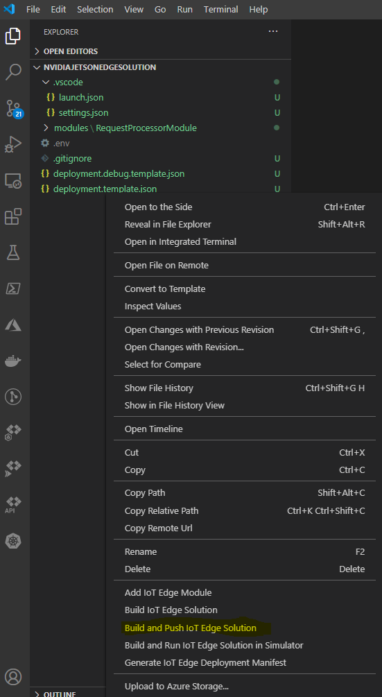

Step 2. The result of above step will be the creation of new folder called "config". The folder will contain a deployment json file corresponding to the default platform selected on step 8 under "Setting up the environment" section. For our Nvidia Jetson Nano device the architecture is arm64v8 as shown below:

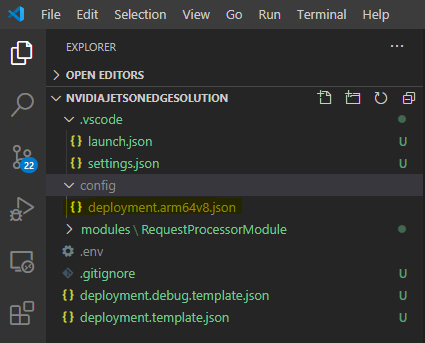

Step 3. [Optional] Removing of SimulatedTemperatureSensor module. If you open the "deployment.arm64v8.json" file under config folder, you will notice that it comes with "RequestProcessorModule" and "SimulatedTemperatureSensor" module. This means if you deploy this deployment json file to the device, you will end up with additional SimulatedTemperatureSensor module. If you would like to not have that module added, then simple remove the section as shown below:
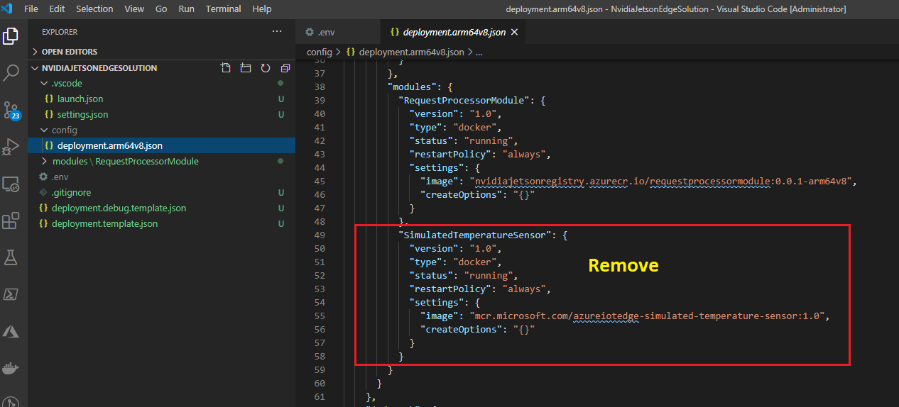

Step 4. Open the "AZURE IOT HUB" section under the "Explorer" panel on VS Code.

Step 5. Select the target IoT Edge Device and right click.

Step 6. Select "Create Deployment for Single Device" menu item as shown below:

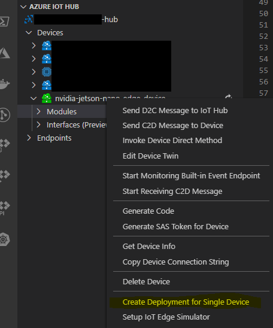

Step 7. This will open a dialog window to asking to select Edge Deployment Manifest. Select the correct deployment manifest file that corresponds to your device architecture under the config folder  as shown below:
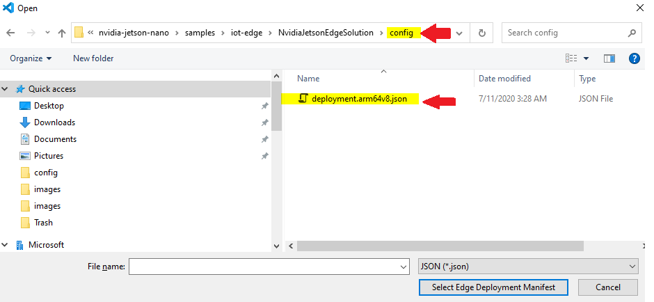

This will result in the deployment of your edge module as shown below:

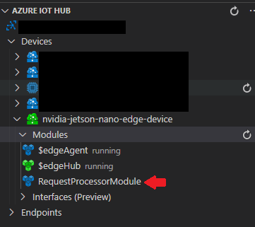

Step 8. Head over the Azure Portal and navigate to IoT Edge Device. This will show the newly created IoT Edge module as shown below:
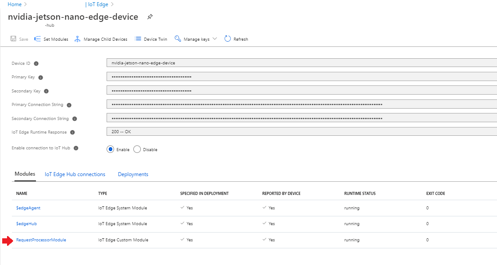

Step 9. To view the newly created IoT Edge module on the device, open the device terminal and run the following command:

```bash
$ sudo iotedge list
```


This will show the newly created IoT Edge module as shown below:
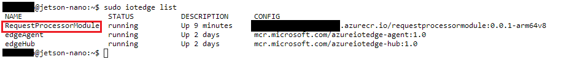

Step 10. To view the log entries by the newly created IoT Edge module, run the following command on the device terminal:

```bash
$ sudo iotedge RequestProcessorModule
```

This will show the following result:

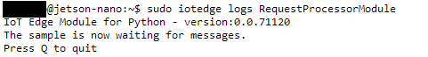

### Test

Step 1. Head over to Azure Portal, select the IoT Edge device, click the "RequestProcessorModule".

Step 2. On the IoT Edge Module Details page, select "Direct Method" link. This will open up "Direct Method" page that is used to test.

Step 3. Execute the test as shown below:

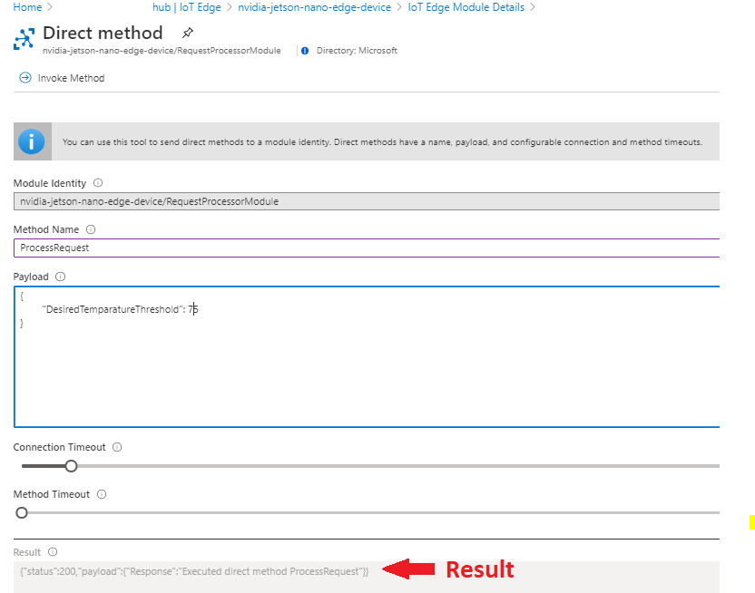

Step 4. Head over to the device terminal and run the following command:

```bash
$ sudo iotedge RequestProcessorModule
```

This will show the following result:

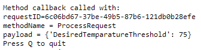

### Conclusion

In this tutorial we have seen how easy it is to create a new Azure IoT Edge module using python and deploy it using VS Code.