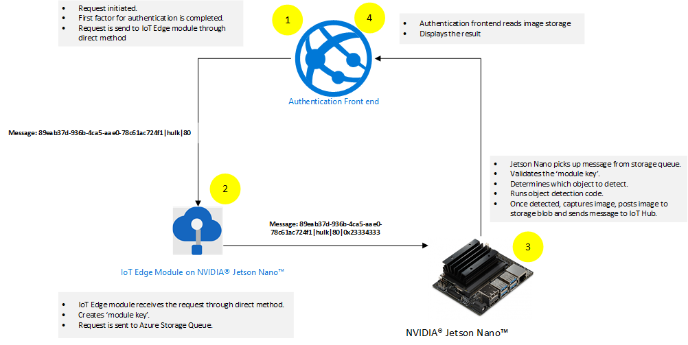
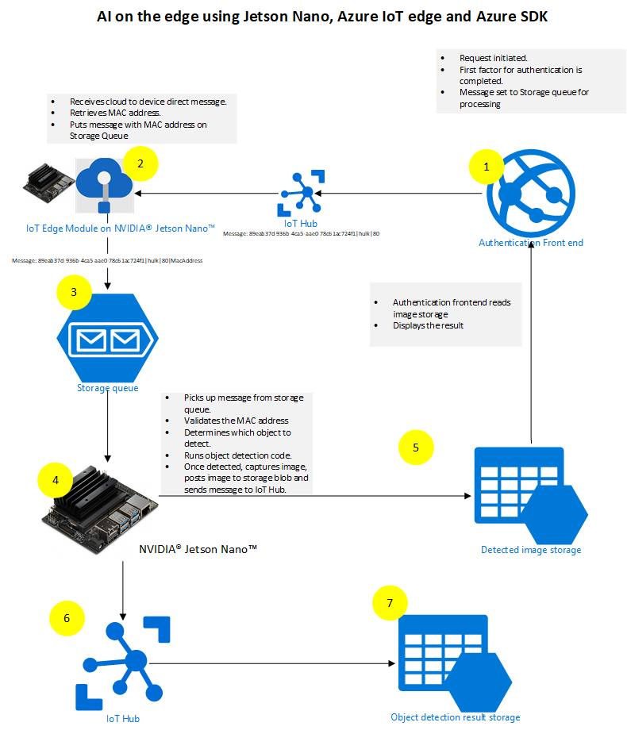
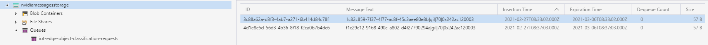
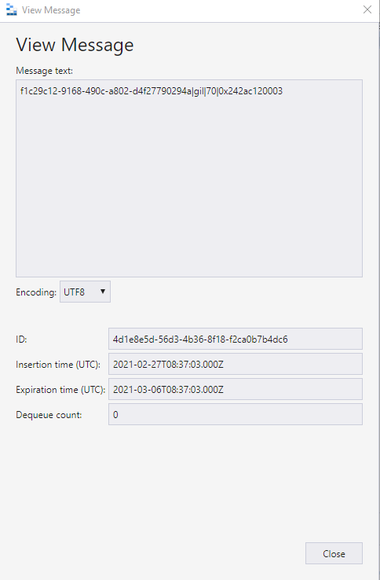
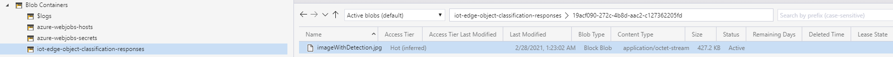
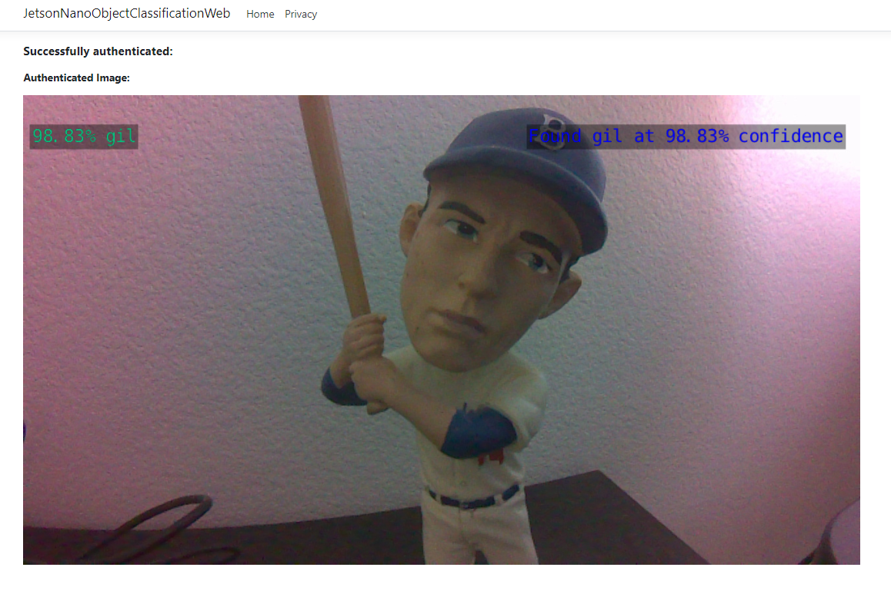
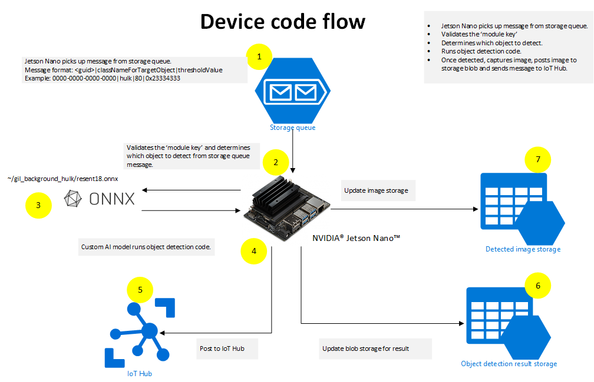

# Introduction

In this post we'll demonstrate how we can use the NVIDIA® Jetson Nano™ device running AI on IoT edge and running IoT Edge module combined with power of Azure platform to create an end-to-end AI on edge solution. This post is based on my previous post published for the Azure SDK [AI on IoT Edge with NVIDIA® Jetson Nano™ and the new Azure SDKs](https://devblogs.microsoft.com/azure-sdk/ai-on-iot-edge/). In this post we will see how IoT Edge module will play an important role of providing communication between various parts of overall architecture. 

This post has been divided into three sections. The **Architecture overview section** discusses the overall architecture at a high-level.  The **Authentication Front-end section** discusses the starting and ending points of the system flow. The **Running AI on the Edge section** talks about details on how the NVIDIA® Jetson Nano™ as an IoT Edge device can run AI and leverage the Azure SDK to communicate with the Azure Platform.

## Architecture overview

There are three main components of the architecture:

- The Authentication Front-end and AI on the edge run by device side code. The Authentication Front-end is responsible for creating a request, which is sent to IoT Edge module deployed on NVIDIA® Jetson Nano™ device.

- The IoT Edge module deployed on NVIDIA® Jetson Nano™ device will be the recipient of request coming from the Authentication Front-end. It will generate a module key based on its MAC address. This module key is then added to the original request payload and send to Azure Storage Queue.

- The device side code is running Python code that is constantly listening to Azure Storage Queue for new requests. It picks up the requests and runs AI on it according to the requests. Once the device side code detects the object, it captures the image of the detected object and posts the captured image to Azure Storage Blob.

The underlying core of the architecture is the use of te new Azure SDKs by the Authentication Front-end and the AI running on the edge. This is done by adding requests to Azure Storage Queue by Authentication Front-end for AI processing and updating the Azure Storage Blob with captured image by the device side Python code.

### Control flow



At a high-level, the following actions are taking place:

1. Authentication Front-end initiates flow by completing the first factor authentication. Once first factor authentication is complete the flow is passed to IoT Edge module deploy on NVIDIA® Jetson Nano™ device.
2. The IoT Edge module receives the request through the direct method and creates a 'module key'. The 'module key' is based on the IoT Edge module's assigned MAC address. The IoT Edge module then posts the message along with 'module key' to Azure Storage Queue using the new Azure SDK.
3. NVIDIA® Jetson Nano™ device runs custom AI model using code mentioned in following sections. The result of this step is completion of the second factor of authentication.
4. The control is passed back to Authentication Front-end which validates the results that came from NVIDIA® Jetson Nano™ device.

Here is the complete architecture showing various components:


## Authentication Front-end

The role of the Authentication Front-end is to initiate the two-factor flow and interact with Azure using the new Azure SDKs.

### Code running on Authentication Front-end

The code running on Authentication Front-end is mainly comprised of two controllers.

The following describes the code for each of those controllers.

#### SendMessageController.cs

The SendMessageController.cs's main job is to complete the first factor of the authentication. The code simulates the completion of the first factor by just ensuring that the username and passwords are the same. In a real world implementation, this should be done by a valid secure authentication mechanism. An example of how to implement secure authentication mechanism is mentioned in the article [Authentication and authorization in Azure App Service and Azure Functions](https://docs.microsoft.com/azure/app-service/overview-authentication-authorization).
The second task that SendMessageController.cs is doing is to send request to IoT Edge module by invoking the IoT Edge module's method.

Here is the code snippet for SendMesssageController.cs:

```c#
        [HttpPost("sendmessage")]
        public IActionResult Index()
        {
            string userName = string.Empty;
            string password = string.Empty;

            if (!string.IsNullOrEmpty(Request.Form["userName"]))
            {
                userName = Request.Form["userName"];
            }

            if (!string.IsNullOrEmpty(Request.Form["password"]))
            {
                password = Request.Form["password"];
            }

            // Simulation of first factor authentication presented here.
            // For real world example visit: https://docs.microsoft.com/azure/app-service/overview-authentication-authorization
            if(!userName.Equals(password, StringComparison.InvariantCultureIgnoreCase))
            {
                return View(null);
            }

            var objectClassificationModel = new ObjectClassificationModel()
            {
                ClassName = userName,
                RequestId = Guid.NewGuid(),
                ThresholdPercentage = 70
            };

            _serviceClient = ServiceClient.CreateFromConnectionString(iotHubConnectionString);
            _ = InvokeMethod(objectClassificationModel);

            return View(objectClassificationModel);
        }

        // Invoke the direct method on the device, passing the payload
        private static async Task InvokeMethod(ObjectClassificationModel objectClassificationModel)
        {
            try
            {
                var methodInvocation = new CloudToDeviceMethod("ProcessRequest") { ResponseTimeout = TimeSpan.FromSeconds(30) };
                var jsonPayload = "{\"CoorelationId\": \"" + objectClassificationModel.RequestId + "\", \"ClassName\": \"" + objectClassificationModel.ClassName + "\", \"ThresholdPercentage\": \"" + objectClassificationModel.ThresholdPercentage.ToString() + "\"}";

                methodInvocation.SetPayloadJson(jsonPayload);

                // Invoke the direct method asynchronously and get the response from the IoT Edge module.
                var response = await _serviceClient.InvokeDeviceMethodAsync("object-detection-device", "ObjectDetectionDeviceModule", methodInvocation);
            }
            catch(Exception exception)
            {
                Console.WriteLine(exception);
            }
        }

```

In the code snippet mentioned above, the code is simulating the first factor by comparing username and password. After the simulation of first factor, the code is sending the request to IoT Edge module. The request to IoT Edge module is sent using the following line:

```c#
                var response = await _serviceClient.InvokeDeviceMethodAsync("object-detection-device", "ObjectDetectionDeviceModule", methodInvocation);
```

In the above line ServiceClient is used invoke a direct method on the IoT Edge module. ServiceClient is part of Microsoft.Azure.Devices namespaces. In the above mentioned line of code, the ServiceClient is using InvokeDeviceMethodAsync method in which "object-detection-device" is the deviceId and "ObjectDetectionDeviceModule" is the module name arguments.

An important thing to note here is that invoking a direct method on IoT Edge module requires knowledge of IoT Edge device and IoT Edge module deployed on it. This creates a tighter coupling between the Authentication front-end and IoT Edge module. This tight coupling results in more secure communication as it is leveraging 'cloud to device' secure communication.

#### ObjectClassificationController.cs

The ObjectClassificationController.cs is initiated after the custom code on AI at the Edge has completed. The code validates if the request has been completed by the NVIDIA® Jetson Nano™ device and then shows the resultant captured image of the detected object.

Here is the code snippet:

```csharp
        public IActionResult Index(string requestId, string className)
        {
            string imageUri = string.Empty;
            Guid requestGuid = default(Guid);
            if (Guid.TryParse(requestId, out requestGuid))
            {
                BlobContainerClient blobContainerClient = new BlobContainerClient(storageConnectionString, containerName);
                foreach (BlobItem blobItem in blobContainerClient.GetBlobs(BlobTraits.All))
                {
                    if (string.Equals(blobItem?.Name, $"{requestId}/{imageWithDetection}", StringComparison.InvariantCultureIgnoreCase))
                    {
                        imageUri = $"{blobContainerClient.Uri.AbsoluteUri}/{blobItem.Name}";
                    }
                }

                ObjectClassificationModel objectClassificationModel = new ObjectClassificationModel()
                {
                    ImageUri = new Uri(imageUri),
                    RequestId = requestGuid,
                    ClassName = className
                };

                return View(objectClassificationModel);
            }

            return View(null);
        }

        [HttpGet("HasImageUploaded")]
        [Route("objectclassification/{imageContainerGuid}/hasimageuploaded")]
        public async Task<IActionResult> HasImageUploaded(string imageContainerGuid)
        {
            
            BlobContainerClient blobContainerClient = new BlobContainerClient(storageConnectionString, "jetson-nano-object-classification-responses");
            await foreach(BlobItem blobItem in blobContainerClient.GetBlobsAsync(BlobTraits.All))
            {
                if (string.Equals(blobItem?.Name, $"{imageContainerGuid}/{imageWithDetection}", StringComparison.InvariantCultureIgnoreCase))
                {
                    return new Json($"{blobContainerClient.Uri.AbsoluteUri}/{blobItem.Name}");
                }
            }
            return new Json(string.Empty);
        }

```

The above mentioned code snippet shows two methods that are using the new Azure SDK. The **HasImageUploaded** method queries the Azure Storage Blob to find if the image has been uploaded or not. The **Index** method simply gets the image reference from Azure Storage Blob. For more information on how to read Azure Blob Storage using the new Azure SDK visit [Quickstart: Azure Blob Storage client library v12 for .NET](https://docs.microsoft.com/azure/storage/blobs/storage-quickstart-blobs-dotnet).

The following steps are taken on the Authentication Front-end:

1. User initiates login by supplying username and password.
2. User is authenticated on the first factor using the combination of username and password.
3. On successful completion of the first factor, the web interface creates a request and sends that to IoT Edge module.
4. The IoT Edge module receives the requests and generates the 'module key'. The 'module key' is added to the request and send to Azure Storage Queue as shown below:


5. The NVIDIA® Jetson Nano™ device, which is listening to Azure Storage Queue, initiates the second factor and completes the second factor.
6. Once the second factor is completed, the NVIDIA® Jetson Nano™ device posts the captured image for the second factor to Azure Storage Blob as shown below:

7. The web interface shows the captured image, completing the flow as shown below:


## IoT Edge module

### IoT Edge module pre-requisites

1. NVIDIA® Jetson Nano™ device to running IoT Edge. Here is a great resource that walks you through step by step [Tutorial: Develop and deploy a Python IoT Edge module for Linux devices](https://docs.microsoft.com/azure/iot-edge/tutorial-python-module).
2. Updated requirements.txt file to reflect requirements for azure storage queue package. Here is how the requirements.txt looks like for this our code:

```python
azure-iot-device~=2.0.0
aiohttp==3.7.4
azure-storage-queue==12.1.5
```

#### Code for the IoT Edge module

Leveraging the code mentioned in [Tutorial: Develop and deploy a Python IoT Edge module for Linux devices](https://docs.microsoft.com/azure/iot-edge/tutorial-python-module), the main.py is modified as below:

```python
# Copyright (c) Microsoft. All rights reserved.
# Licensed under the MIT license. See LICENSE file in the project root for
# full license information.

import uuid
import re
import json
import time
import types
import os
import sys
import asyncio
from six.moves import input
import threading
from azure.iot.device.aio import IoTHubModuleClient
from azure.iot.device import MethodResponse
from azure.storage.queue.aio import QueueClient

# global counters
TWIN_CALLBACKS = 0
RECEIVED_MESSAGES = 0

# A helper class to support async queue actions.
class StorageHelperAsync:
    async def queue_send_message_async(self, message):
        # from azure.storage.queue.aio import QueueClient
        queue_client = QueueClient.from_connection_string(
            os.getenv("storage_connection_string"),
            "iot-edge-object-classification-requests",
        )

        async with queue_client:
            await queue_client.send_message(message)
    
async def main():
    try:
        if not sys.version >= "3.5.3":
            raise Exception( "The module requires python 3.5.3+. Current version of Python: %s" % sys.version )
        print ("IoT Edge Module for receiving direct method and posting module key to queue - version:1.5.00001" )
        # The client object is used to interact with your Azure IoT hub.
        module_client = IoTHubModuleClient.create_from_edge_environment()

        # connect the client.
        await module_client.connect()

        # define behavior for receiving an input message on input1
        async def input1_listener(module_client):
            global RECEIVED_MESSAGES
            while True:
                try:
                    method_request = await module_client.receive_method_request()
                    print (
                        "\nMethod callback called with:\nrequestID={request_id}\nmethodName = {method_name}\npayload = {payload}".format(
                            request_id=method_request.request_id,
                            method_name=method_request.name,
                            payload=method_request.payload
                        )
                    )
                    json_object = json.dumps(method_request.payload)
                    json_deserialized = json.loads(json_object)
                    module_key = hex(uuid.getnode())
                    correlation_id = json_deserialized["CoorelationId"]
                    class_name = json_deserialized["ClassName"]
                    threshold_percentage = json_deserialized["ThresholdPercentage"]
                    module_payload = correlation_id + "|" + class_name + "|" + str(threshold_percentage) + "|" + module_key
                    print(module_payload)
                    storage_helper = StorageHelperAsync()
                    await storage_helper.queue_send_message_async(module_payload)
                    print("message sent to queue")
                    response_payload = {"Response": "Executed direct method {}".format(method_request.name)}
                    response_status = 200                    

                    # Creating a method response.
                    methodResponse = MethodResponse.create_from_method_request(method_request, response_status, response_payload)

                    # Responding back to the direct method call.                 
                    await module_client.send_method_response(methodResponse)

                    
                except Exception as ex:
                    print ("Unexpected error in input1_listener: %s" % ex)
                                     

        # twin_patch_listener is invoked when the module twin's desired properties are updated.
        async def twin_patch_listener(module_client):
            global TWIN_CALLBACKS
            while True:
                try:
                    data = await module_client.receive_twin_desired_properties_patch()  # blocking call
                    print( "The data in the desired properties patch was: %s" % data)
                    TWIN_CALLBACKS += 1
                    print ( "Total calls confirmed: %d\n" % TWIN_CALLBACKS )
                except Exception as ex:
                    print ( "Unexpected error in twin_patch_listener: %s" % ex )

        # define behavior for halting the application
        def stdin_listener():
            while True:
                try:
                    selection = input("Press Q to quit\n")
                    if selection == "Q" or selection == "q":
                        print("Quitting...")
                        break
                except:
                    time.sleep(10)

        # Schedule task for C2D Listener
        listeners = asyncio.gather(input1_listener(module_client), twin_patch_listener(module_client))

        print ( "The iot edge module is now waiting for messages. ")

        # Run the stdin listener in the event loop
        loop = asyncio.get_event_loop()
        user_finished = loop.run_in_executor(None, stdin_listener)

        # Wait for user to indicate they are done listening for messages
        await user_finished

        # Cancel listening
        listeners.cancel()

        # Finally, disconnect
        await module_client.disconnect()

    except Exception as e:
        print ( "Unexpected error %s " % e )
        raise

if __name__ == "__main__":
    loop = asyncio.get_event_loop()
    loop.run_until_complete(main())
    loop.close()

    # If using Python 3.7 or above, you can use following code instead:
    # asyncio.run(main())
```

In the above mentioned code, the IoT Edge module is waiting for the direct method call. This call is coming from the Azure IoT Hub initiated by the Authenticator front-end. Once the request is received by the IoT Edge module, it generates a 'module key'. The 'module key' is generated by using IoT Edge module's own MAC address. The 'module key' acts a security key as this is unique for each IoT Edge module. Once the 'module key' is sent to device code running the AI through Azure Storage Queue, it will be used to valid the request as a secured request. Here is the code that generates the 'module key':

```python
module_key = hex(uuid.getnode())
```

Once the 'module key' is generated a new request is created by adding 'module key' to the original request that came to IoT Edge module. The new request is sent to Azure Storage queue using the new Azure SDK.

Here is the link for code for main.py to try out: <https://gist.github.com/nabeelmsft/ef53454da5b0afd2dce200c81b963ee4>

## Running AI on the Edge

### Device pre-requisites

1. NVIDIA® Jetson Nano™ device with camera attached to capture video image.
2. Custom pre-training model deployed on the device.
3. Location path to the custom model file (.onnx file). This information is presented as --model parameter to the command mentioned in Steps section. For this tutorial we have prepared a custom model and saved as "~/IoT/object-detection-device/AI/gil_background_hulk/resenet18.onnx".
4. Location path to the classification text file (labels.txt). This information is presented as --labels parameter to the command mentioned in Steps section.
5. MODULE_KEY environment variable that is representing the IoT Edge module's MAC address. This is generate by the IoT Edge module as mentioned in the previous section. Since the IoT Edge module is running as docker containers, you can retrieve that by running docker inspect command as shown below:

```bash
sudo docker inspect <container name or id>|grep MacAddress
```

6. Azure IoT Hub libraries for Python. Install the azure-iot-device package for IoTHubDeviceClient.

```bash
pip3 install azure-iot-device
```

### Code running AI on the Edge

If we look at the technical specifications for NVIDIA® Jetson Nano™ device, we will notice that it is based on ARM architecture running Ubuntu (in my case it was release: 18.04 LTS). With that knowledge it became clear that Python would be good choice of language running at device side. The device side code is shown below:

```python
#!/usr/bin/python

import jetson.inference
import jetson.utils

import argparse
import sys

import os
import asyncio
from azure.iot.device.aio import IoTHubDeviceClient
from azure.storage.queue.aio import QueueClient
from azure.storage.blob.aio import BlobServiceClient, BlobClient, ContainerClient

# A helper class to support async blob and queue actions.
class StorageHelperAsync:
    async def block_blob_upload_async(self, upload_path, savedFile):
        blob_service_client = BlobServiceClient.from_connection_string(
            os.getenv("STORAGE_CONNECTION_STRING")
        )
        container_name = "iot-edge-object-classification-responses"

        async with blob_service_client:
            # Instantiate a new ContainerClient
            container_client = blob_service_client.get_container_client(container_name)

            # Instantiate a new BlobClient
            blob_client = container_client.get_blob_client(blob=upload_path)

            # Upload content to block blob
            with open(savedFile, "rb") as data:
                await blob_client.upload_blob(data)
                # [END upload_a_blob]

    # Code for listening to Storage queue
    async def queue_receive_message_async(self):
        # from azure.storage.queue.aio import QueueClient
        queue_client = QueueClient.from_connection_string(
            os.getenv("STORAGE_CONNECTION_STRING"),
            "iot-edge-object-classification-requests",
        )

        async with queue_client:
            response = queue_client.receive_messages(messages_per_page=1)
            async for message in response:
                queue_message = message
                await queue_client.delete_message(message)
                return queue_message


async def main():

    # Code for object detection
    # parse the command line
    parser = argparse.ArgumentParser(
        description="Classifying an object from a live camera feed and once successfully classified a message is sent to Azure IoT Hub",
        formatter_class=argparse.RawTextHelpFormatter,
        epilog=jetson.inference.imageNet.Usage(),
    )
    parser.add_argument(
        "input_URI", type=str, default="", nargs="?", help="URI of the input stream"
    )
    parser.add_argument(
        "output_URI", type=str, default="", nargs="?", help="URI of the output stream"
    )
    parser.add_argument(
        "--network",
        type=str,
        default="googlenet",
        help="Pre-trained model to load (see below for options)",
    )
    parser.add_argument(
        "--camera",
        type=str,
        default="0",
        help="Index of the MIPI CSI camera to use (e.g. CSI camera 0)\nor for VL42 cameras, the /dev/video device to use.\nby default, MIPI CSI camera 0 will be used.",
    )
    parser.add_argument(
        "--width",
        type=int,
        default=1280,
        help="Desired width of camera stream (default is 1280 pixels)",
    )
    parser.add_argument(
        "--height",
        type=int,
        default=720,
        help="Desired height of camera stream (default is 720 pixels)",
    )
    parser.add_argument(
        "--classNameForTargetObject",
        type=str,
        default="",
        help="Class name of the object that is required to be detected. Once object is detected and threshhold limit has crossed, the message would be sent to Azure IoT Hub",
    )
    parser.add_argument(
        "--detectionThreshold",
        type=int,
        default=90,
        help="The threshold value 'in percentage' for object detection",
    )

    try:
        opt = parser.parse_known_args()[0]
    except:
        parser.print_help()
        sys.exit(0)

    # load the recognition network
    net = jetson.inference.imageNet(opt.network, sys.argv)

    # create the camera and display
    font = jetson.utils.cudaFont()
    camera = jetson.utils.gstCamera(opt.width, opt.height, opt.camera)
    display = jetson.utils.glDisplay()
    input = jetson.utils.videoSource(opt.input_URI, argv=sys.argv)

    # Fetch the connection string from an environment variable
    conn_str = os.getenv("IOTHUB_DEVICE_CONNECTION_STRING")

    device_client = IoTHubDeviceClient.create_from_connection_string(conn_str)
    await device_client.connect()

    counter = 1
    still_looking = True
    # process frames until user exits
    while still_looking:
        storage_helper = StorageHelperAsync()
        queue_message = await storage_helper.queue_receive_message_async()

        print("Waiting for request queue_messages")
        print(queue_message)
        if queue_message:
            queue_message_array = queue_message.content.split("|")
            request_content = queue_message.content
            correlation_id = queue_message_array[0]
            class_for_object_detection = queue_message_array[1]
            threshold_for_object_detection = int(queue_message_array[2])
            module_key = queue_message_array[3]
            if module_key == os.getenv("MODULE_KEY"):
                has_new_message = True
            else:
                has_new_message = False
                print("Module key does not match")
	
            while has_new_message:
                # capture the image
                # img, width, height = camera.CaptureRGBA()
                img = input.Capture()

                # classify the image
                class_idx, confidence = net.Classify(img)

                # find the object description
                class_desc = net.GetClassDesc(class_idx)

                # overlay the result on the image
                font.OverlayText(
                    img,
                    img.width,
                    img.height,
                    "{:05.2f}% {:s}".format(confidence * 100, class_desc),
                    15,
                    50,
                    font.Green,
                    font.Gray40,
                )

                # render the image
                display.RenderOnce(img, img.width, img.height)

                # update the title bar
                display.SetTitle(
                    "{:s} | Network {:.0f} FPS | Looking for {:s}".format(
                        net.GetNetworkName(),
                        net.GetNetworkFPS(),
                        opt.classNameForTargetObject,
                    )
                )

                # print out performance info
                net.PrintProfilerTimes()
                if (
                    class_desc == class_for_object_detection
                    and (confidence * 100) >= threshold_for_object_detection
                ):
                    message = request_content + "|" + str(confidence * 100)
                    font.OverlayText(
                        img,
                        img.width,
                        img.height,
                        "Found {:s} at {:05.2f}% confidence".format(
                            class_desc, confidence * 100
                        ),
                        775,
                        50,
                        font.Blue,
                        font.Gray40,
                    )
                    display.RenderOnce(img, img.width, img.height)
                    savedFile = "imageWithDetection.jpg"
                    jetson.utils.saveImageRGBA(savedFile, img, img.width, img.height)

                    # Create the BlobServiceClient object which will be used to create a container client
                    blob_service_client = BlobServiceClient.from_connection_string(
                        os.getenv("STORAGE_CONNECTION_STRING")
                    )
                    container_name = "iot-edge-object-classification-responses"

                    # Create a blob client using the local file name as the name for the blob
                    folderMark = "/"
                    upload_path = folderMark.join([correlation_id, savedFile])

                    # blob_helper = StorageHelperAsync()
                    await storage_helper.block_blob_upload_async(upload_path, savedFile)

                    await device_client.send_message(message)
                    still_looking = True
                    has_new_message = False

    await device_client.disconnect()


if __name__ == "__main__":
    # asyncio.run(main())
    loop = asyncio.get_event_loop()
    loop.run_until_complete(main())
    loop.close()
```

Here is the link for code to try out: <https://gist.github.com/nabeelmsft/1fe04b2a4e40cd7f53fd7c49bd40e7c3>

#### Code flow



The following actions take place in python code running on the device side:

1. The device code is constantly reading the request coming to Azure Storage Queue.
2. Once request is received; code extracts out which object to detect and what threshold to use for object detection. The example mentioned in the diagram shows the message as: 0000-0000-0000-0000|hulk|80|0x23334333. The code will extract "hulk" as the object that needs to be detected, "80" as threshold value and 0x23334333 as 'module key' to be validated. This format is just an example that is used to provide input values to device side code.
3. Using the custom AI model (example: ~/gil_background_hulk/resenet18.onnx) running on Jetson Nano device, object is searched based on the request.
4. As soon as object is detected, the python code running on Jetson Nano device posts captured image to Azure Blob storage.
5. In addition, the code running on Jetson Nano device sends message to Azure IoT hub informing of correct match for the request.

Once the device side code completes the flow, the object detected image is posted to Azure Storage blob along with posting to Azure IoT Hub. The web interface then takes control and completes the rest of the steps.

## Conclusion

In this post we have seen how simple it is for running IoT Edge modules and AI on edge using NVIDIA® Jetson Nano™ on same device leveraging Azure platform. Azure SDKs are designed to work great with a python on linux based IoT devices. We have also seen how Azure SDK plays the role of stitching different components together for a complete end to end solution.

<!-- TIPS:
- Use `SDK` when talking about all of the client libraries.
- Use `Client libraries/ry` when talking about individual libraries.
- Make sure all links do not have Locale, i.e remove `en-us` from all links.
- All image links need to start with `./images/posts/*.png` and need to match exact case of the file.
- Avoid using `here` for link text. Use the title of the link/file.
- Please include summary at the end.
-->

<!-- FOOTER: DO NOT EDIT OR REMOVE -->

<!-- FOOTER: DO NOT EDIT OR REMOVE -->
